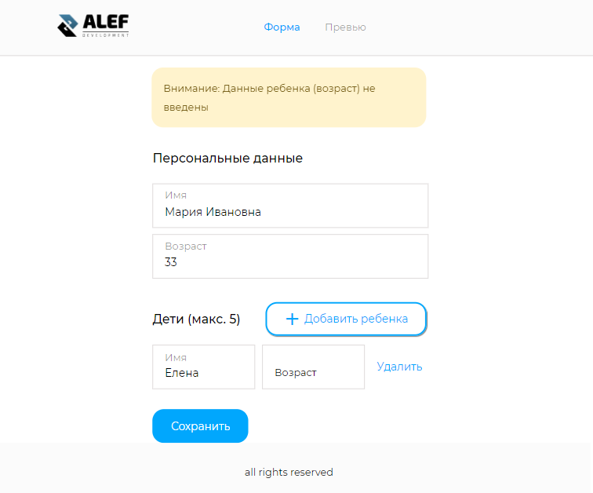

Использует **React**, **Redux**.

Реализует функционал приложения, где пользователь может заполнить информацию о себе и своих детях.

Статус: стадия разработки. 

-----

- [Маршрутизация](#Маршрутизация)
- [useContext](#useContext)
- [Структура](#Структура)

# Маршрутизация

1. **Создаем страницы**

В проекте будет две страницы. Создаем страницы Home и Preview.

Home - это форма заполнения

Preview - страница с сохраненными данными.

2. **Перечисляем в константах пути к ним:**

*src/routes/constants.js*

    export const HOME_ROUTE = `/home`;
    export const PREVIEW_ROUTE = `/preview`;

3. **Описываем пути в виде массива объектов:**

*src/routes/routes.js*

    import {HOME_ROUTE, PREVIEW_ROUTE} from './constants';
    import {Home, Preview} from '../pages';

    export const publicRoutes = [
      {title: `Form`, path: HOME_ROUTE, Component: Home},
      {title: `Preview`, path: PREVIEW_ROUTE, Component: Preview},
    ];

4. **Создаем компонент отвечающий за навигацию:**

Она позволит перемещаться между страницами при клике по указанному пункту. Используем NavLink. В отличии от простого Link, он позволяет воспользоваться стилизацией для выделения активной ссылки. NavLink включает в себя activeClassName (значение которого просто добавляется к стилизации) и/или activeStyle (используется в качестве встроенной стилизации, например activeStyle={{color: "green", fontWeight: "bold"}}). Стилизацию добавим позднее

*src/components/navbar/Navbar.jsx*

    import React from 'react';
    import {NavLink} from "react-router-dom";
    import {publicRoutes} from '../../routes/routes';

    const Navbar = () => {
      return (
        <ul className="navbar__list">
          {publicRoutes.map(({path, title}) => (
            <li key={path} className="navbar__item">
              <NavLink to={path}>
                {title}
              </NavLink>
            </li>
          ))}
        </ul>
      );
    };

    export default Navbar;

5. **Подключаем маршрутизацию:**

Switch итерируется по всем путям и в том случае, если ничего не найдено, возвращает последний маршрут. В нашем случае - Redirect. Это необходимо для того, чтобы пользователь, при неверном наборе пути, возвращался на HOME_ROUTE:

*src/App.js*

    import React from 'react';
    import {BrowserRouter, Switch, Route, Redirect} from "react-router-dom";
    import Bottom from './components/bottom/Bottom';
    import Navbar from './components/navbar/Navbar';
    import {HOME_ROUTE} from './routes/constants';
    import {publicRoutes} from './routes/routes';

    function App() {
      return (
        <BrowserRouter>
            <Navbar />
            

              <Switch>
                {publicRoutes.map(({title, path, Component}) => <Route key={title} path={path} component={Component} exact />)}
                <Redirect to={HOME_ROUTE} />
              </Switch>
            

            <Bottom />
        </BrowserRouter>
      );
    }

    export default App;

# useContext

Задача следующая: изменения в форме (на странице Home) временные и сбрасываются при, например, марщрутизации. Но их можно сохранить в store посредством клика на кнопке "Сохранить". В этом случае результат будет также отражаться и на странице Preview

Если следовать этой логике, создадим два хранилища: 
- постоянное (userState) 
- временное, которое будет находиться в странице Home и которое будет хранить актуальные записи

Итак, создадим store, а доступ к нему реализуем через хук useContext. Для этого определимся со структурой хранилища. Пусть оно будет иметь поле user, которое содержит массив объектов. Содержание объектов исходит из перечисления необходимых данных типа [`title`, `age`, и т.д.]. Если ориентироваться на такой концепт, то со временем, в случае необходимости, количество и наименования полей можно будет легко скорректировать.

    const initialState = {user: [{id, `title`: value, `age`: value}, и т.д.]};

1. **Создаем базовую структуру**:

*src/context/user/userInputNamesList.js*

    export const userInputNamesList = [`title`, `age`,];

2. **Создаем экшены**:

Пока из необходимых действий нам нужно только обновление store:

*src/context/user/userActions.js*

    export const UPDATE = 'UPDATE';

3. **Создаем редьюсер**:

Отправляя действия в редьюсер, мы можем воздействовать на стейт определенным образом. Существует несколько паттернов создания редьюсера. В данном случае воспользуемся литералами объекта:

*src/context/user/userReducer.js*

    import {UPDATE} from "./userActions";

    const handlers = {
      [UPDATE]: (state, {payload}) => ({
        ...state, user: payload
      }),
      DEFAULT: state => state,
    };

    export const userReducer = (state, action) => {
      const handle = handlers[action.type] || handlers.DEFAULT;
      return handle(state, action);
    };

4. **Извлекаем контекст**:

Именно этот инструмент предоставляет различным компонентам доступ к стейту user:

*src/context/user/userContext.js*

    import {createContext} from "react";

    export const UserContext = createContext();

5. **Создаем хранилище userState**:

Создаем компонент, который содержит 
- стейт 
- метод dispatch, который воздействует на стейт
- набор функции, которые оборачивают dispatch и производят необходимые действия

Данный компонент будет оборачивать все приложение. Пока это фейковые значения.

В пропсы провайдера передаем и сам стейт и функции взаимодействия {add, remove, user: state}:

*src/context/user/UserState.js*

    import React, {useReducer} from 'react';
    import {UPDATE} from './userActions';
    import {UserContext} from "./userContext";
    import {userReducer} from './userReducer';

    const initialState = {
      user: [
        {
          id: 0,
          ...Object.fromEntries(userInputNamesList.map((inputName) => [inputName, ``]))
        },
        {id: 1, title: `Мария`, age: `5`,},
        {id: 2, title: `Тимофей`, age: `7`,},
        {id: 3, title: `Владимир`, age: `2`,},
    ]};

    export const UserState = ({children}) => {
      const [state, dispatch] = useReducer(userReducer, initialState);

      const update = (payload) => {
        dispatch({
          type: UPDATE,
          payload,
        });
      };

      return (
        <UserContext.Provider value={{update, user: state}} >
          {children}
        </UserContext.Provider>
      );
    };

6. **Оборачиваем все компоненты в UserState**. 

Тем самым абсолютно любые компоненты имеют доступ к стейту Alert при использовании его контекста {add, remove, user: state}.

*src/App.js*

    import React from 'react';
    import {BrowserRouter, Switch, Route, Redirect} from "react-router-dom";
    import {Bottom, Navbar} from './components';
    import {UserState} from './context/user/UserState';
    import {HOME_ROUTE} from './routes/constants';
    import {publicRoutes} from './routes/routes';

    function App() {
      return (
        <UserState>
          <BrowserRouter>
              <Navbar />
              

                <Switch>
                  {publicRoutes.map(({title, path, Component}) => <Route key={title} path={path} component={Component} exact />)}
                  <Redirect to={HOME_ROUTE} />
                </Switch>
              

              <Bottom />
          </BrowserRouter>
        </UserState>
      );
    }

    export default App;

7. **Использование контекста в компонентах**.

Все, что нужно теперь для извлечения стейта, это использовать по типу

    const {add, remove, user: state} = useContext(UserContext)

*src/pages/Home.jsx*

    import React, {useContext} from 'react';
    import {UserContext} from '../../context/user/userContext';

    const Home = () => {
      const {user, update} = useContext(UserContext);

      console.log(`user in Home: `, user);

      return (
        

          Домашняя страница
        

      );
    };

    export default Home;

# Структура

Структура основывается на базовам объекте типа {id: 1, title: `Мария`, age: `5`,}.

## Control

Находится в основании структуры. Отрисовывает группу состоящую из label+input. 

Получает:
- memberId - идентификатор, который обозначает, к какому объекту данная группа принадлежит 
- inputTitle - имя поля
- inputData - значение поля

Возвращает: 
- onInputChange - символ при изменении в input

## Controls

Средняя часть. Отрисовывает несколько компонентов Control и button:remove

Получает:
- entry - главный объект типа {id: 1, title: `Мария`, age: `5`,}

Возвращает: 
- onInputChange - символ при изменении в input
- onRemove - клик на button:remove

## Home

Страница Home состоит из двух практически идентичных частей разнесенных в теги section. Они включают компонент Controls, с той лишь разницей, что в первой отрисовывается лишь array[0] из хранилища, а во второй - в цикле - весь array за исключением array[0]. 

Передает в Controls 
- главный объект типа {id: 1, title: `Мария`, age: `5`,}

Получает: 
- onInputChange, который в функции changeTemporaryEntry сохраняет введенные в инпут изменения во временный стор temporary
- onRemove, который в функции deleteTemporaryEntry удаляет группу Controls по id

Помимо этого страница содержит 
- temporary - временное хранилище, с которым ведутся все текущие операции
- createTemporaryEntry - создает новую запись (главный объект типа {id: 1, title: `Мария`, age: `5`,})
- handleSubmit - это основа взаимодействия между userStore и temporary. Сохраняет данные temporary в userStore
